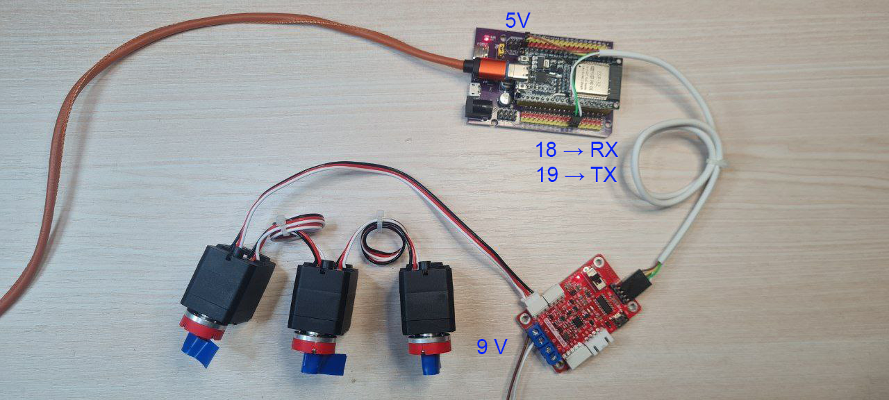

# FEETECH STS UART Text Controller (ESP32)

Cкетч для работы с сервоприводами **FEETECH STS** (например,
STS3215) по шине UART1 на **ESP32**.

Этот проект даёт **один стандартный текстовый протокол**, поверх
которого можно:

1.  Найти сервоприводы на шине (`PING`, `SCAN_ID`)
2.  Задать / изменить ID (`SET_ID`)
3.  Переключить режим работы сервопривода (`SET_SERVO`, `SET_WHEEL`,
    `READ_MODE`)
4.  Управлять сервой:
    -   в позиционном режиме (угол/позиция)
    -   в колёсном режиме (постоянная скорость)
5.  Управлять усилием и читать параметры (нагрузка, напряжение,
    температура)

> ⚠️ Скетч предназначен для **настройки, тестов и обучения**.
> В рабочих проектах лучше использовать бинарный протокол и избегать
> `String` из-за динамического выделения памяти.

Для работы с ESP32 используется библиотека scs-servo.
Добавлена в репозиторий, исходник: https://github.com/workloads/scservo



------------------------------------------------------------------------

# 📘 Содержание

1.  [Общее описание](#общее-описание)
2.  [Архитектура](#архитектура)
3.  [Подключение аппаратуры](#подключение-аппаратуры)
4.  [Особенности протокола FEETECH
    STS](#особенности-протокола-feetech-sts)
5.  [Формат текстовых команд](#формат-текстовых-команд)
6.  [Полный набор команд](#полный-набор-команд)
7.  [Сценарии использования](#сценарии-использования)
8.  [Разбор команд по режимам](#разбор-команд-по-режимам)
9.  [Отладка и диагностика](#отладка-и-диагностика)
10. [Дополнительно: как работают STS
    внутри](#дополнительно-как-работают-sts-внутри)
11. [FAQ](#faq)

------------------------------------------------------------------------


# Общее описание

Проект решает две главные задачи:

### **1. Унификация**

Единый текстовый протокол позволяет студентам, инженерам и
робототехникам быстро тестировать сервы FEETECH без изучения протокола.

### **2. Безопасность и предсказуемость**

Все команды имеют фильтрацию параметров и не позволяют вывести
сервопривод за допустимый диапазон (позиция, скорость, ID и т. д.).

------------------------------------------------------------------------

# Архитектура

    ПК (Serial @115200)
         ↓ команды/ответы
    ESP32
         ↓ UART1 @ 1_000_000
    Плата-переходник FEETECH STS
	     ↓ 
    Сервоприводы FEETECH STS

ESP32 принимает текстовые строки, парсит команду и вызывает
соответствующую функцию библиотеки **SCServo**.

------------------------------------------------------------------------

# Подключение аппаратуры

## Схема

    ESP32 (UART1) → FEETECH STS bus

  ESP32 GPIO   Серво-шина
  ------------ -------------------
  RX1 (18)     RX платы-переходника
  TX1 (19)     TX платы-переходника
  GND          GND платы-переходника
  5V           5V платы-переходника

> ⚠️ Питание сервоприводов всегда отдельно!
> 6--8.4 (для некоторых серв до 12) В (согласно их спецификации), 
> большой ток --- до 2--3 А на серво. Учитывайте при подборе блока питания

------------------------------------------------------------------------

# Особенности протокола FEETECH STS

-   Скорость: **1 000 000 бод**
-   Полудуплексная линия (в большинстве кабелей автоматически
    организована)
-   Протокол бинарный, но в данном проекте ESP32 "переводит" его в
    читаемый текст.

------------------------------------------------------------------------

# Формат текстовых команд

### Строка формата:

    <КОМАНДА> <арг1> <арг2> ... <аргN>

Пример:

    MOVE 100 2048 400 50

Все команды регистронезависимы:

    move 100 2048 400 50
    MoVe 100 2048 400 50

работают так же, как:

    MOVE 100 2048 400 50

------------------------------------------------------------------------

# Полный набор команд

------------------------------------------------------------------------

## 1) Поиск сервоприводов

### `PING <id>`

Проверяет одиночный ID.

    PING 100
    → OK

### `SCAN_ID [from] [to]`

Сканирует диапазон ID.

    SCAN_ID 0 253
    SCAN_ID 100
    SCAN_ID

------------------------------------------------------------------------

## 2) Работа с ID

### `SET_ID <oldId> <newId>`

    SET_ID 1 100

------------------------------------------------------------------------

## 3) Режимы работы

### `SET_SERVO <id>`

Позиционный режим (угол).

### `SET_WHEEL <id>`

Колёсный режим (бесконечное вращение).

### `READ_MODE <id>`

Показывает:

    MODE 0  → позиционный
    MODE 1  → колесный

------------------------------------------------------------------------

## 4) Управление (позиционный режим)

### `MOVE <id> <position> <speed> <acc>`

-   position: 0...4095
-   speed: 0...4095
-   acc: 0...4095

### `SYNC_MOVE <n> <id pos speed acc> ...`

### `READ_POS <id>`

### `SCAN_POS [from] [to]`

------------------------------------------------------------------------

## 5) Управление (wheel-режим)

### `SPEED <id> <speed>`

Диапазон: **-4095 ... +4095**

### `SYNC_SPEED <n> <id1 speed1> <id2 speed2> ...`

### `STOP <id>`

### `STOP_ALL`

### `READ_SPEED <id>`

------------------------------------------------------------------------

## 6) Усилие и телеметрия

### `ENABLE_TORQUE <id>`

### `DISABLE_TORQUE <id>`

### `READ_LOAD <id>`

### `READ_VOLTAGE <id>`

### `READ_TEMP <id>`

------------------------------------------------------------------------

# Сценарии использования

## 🎯 Сценарий 1 --- первичная настройка серв

1.  Подключить одну серву.
2.  Выполнить:

```{=html}
<!-- -->
```
    SCAN_ID

3.  Если требуется --- поменять ID:

```{=html}
<!-- -->
```
    SET_ID 1 100

4.  Проверить:

```{=html}
<!-- -->
```
    PING 100

------------------------------------------------------------------------

## 🎯 Сценарий 2 --- проверка работоспособности

    SET_SERVO 100
    MOVE 100 2048 400 50
    READ_POS 100

------------------------------------------------------------------------

## 🎯 Сценарий 3 --- колесный режим

    SET_WHEEL 100
    SPEED 100 800
    READ_SPEED 100
    STOP 100

------------------------------------------------------------------------

## 🎯 Сценарий 4 --- чтение телеметрии

    READ_LOAD 100
    READ_TEMP 100
    READ_VOLTAGE 100

------------------------------------------------------------------------

# Разбор команд по режимам

## SERVO mode (MODE=0)

Используется для манипуляторов, суставов, роборуки, робота-собаки.

Управление углом:

    MOVE 100 1024 300 50
    MOVE 100 3072 300 50

## WHEEL mode (MODE=1)

Используется для: - колес омни-платформ, - непрерывных приводов

Управление скоростью:

    SPEED 10 800
    STOP 10

------------------------------------------------------------------------

# Отладка и диагностика

Типичные ошибки:

  -----------------------------------------------------------------------
  Ошибка                            Причина
  --------------------------------- -------------------------------------
  `ERROR: Ping fail`                Неверный ID, плохой контакт,
                                    отсутствует питание на сервах

  `ERROR` на командах движения      torque OFF

  Серво дергается                   Нет общей земли или слишком слабый БП
  -----------------------------------------------------------------------

------------------------------------------------------------------------

# Дополнительно: как работают STS внутри

FEETECH STS --- это: - контроллер серво внутри корпуса, - энкодер
абсолютной позиции, -  драйвер, - схема управления PID, -
протокол с CRC, - EEPROM и RAM регистры.

Позиционный режим использует: - PID-регуляцию по абсолютному энкодеру.

Wheel-режим: - отключает позиционный регулятор, - превращает серво в
"обычный мотор с драйвером".

------------------------------------------------------------------------

# FAQ

### Q: Можно ли использовать этот скетч для реальных роботов?

Да, безопасно, но лучше убрать "String" и использовать бинарный
протокол.

### Q: Какие модели поддерживаются?

Все STS: STS3032, STS3215, STS3035, STS3215-MG и т. д.

### Q: Можно ли расширить команды?

Да. Код структурирован так, что добавление новой команды --- 3--5 строк.

------------------------------------------------------------------------

# Лицензия

MIT License. Можно использовать в учебных проектах и коммерческих
разработках.